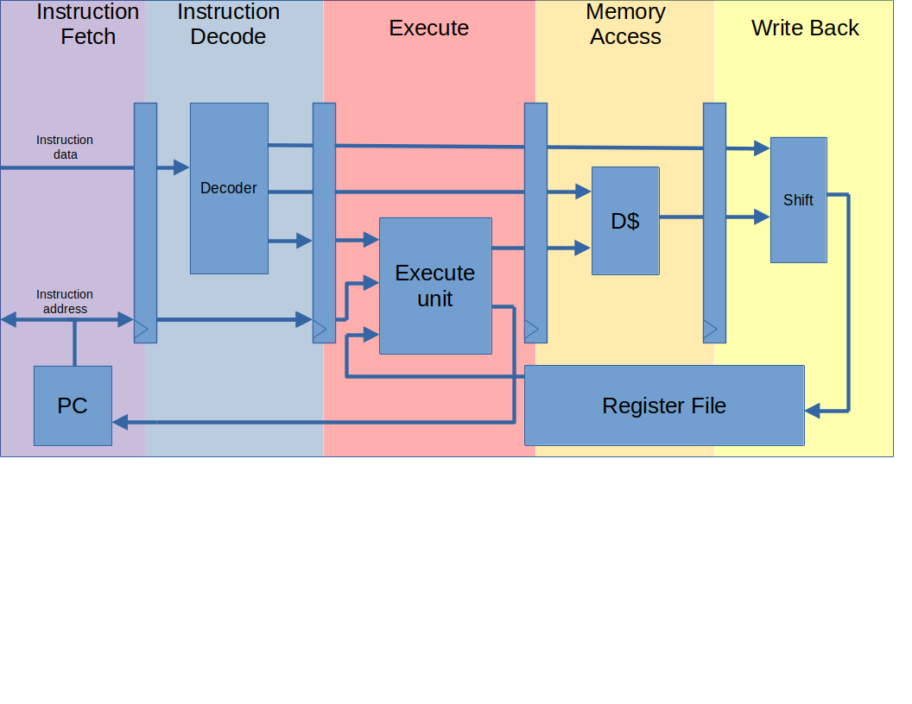

# PAF-RISCV

This is the repository for a core designed for educational use by students at Telecom Paris for FPGA targets. It supports the `rv32ib` ISA.

The core is formally verified using [riscv-formal](https://github.com/YosysHQ/riscv-formal). See the #Verification section for more details and instructions to reproduct the verification.

---

The rv32i core was written by Florian Tarazona (florian.tarazona@telecom-paris.fr) and Erwan Glasziou (erwan.glasziou@telecom-paris.fr) as a university project. Some modificatins were done by Mathieu Serandour (mathieu.serandour@telecom-paris.fr) to formally verify it and implement the bit manip extension.

## Timing and Area performance

The design for the `rv32ib` version, located in the main branch, takes around __2200 ALUTs__ for a cyclone V target using the Altera's Quartus synthesis flow, and performs 4-cycle carry-less multiplications. 

The rv32i version (__available on the rv32i branch__) Takes around __1900 ALUTs__ for the same target.

Both versions have an estimated __Fmax of 87 MHz__ for the fast 85 °C quartus model for the Cyclone V target. 

The synthesis has been done on a Cyclone V 5CSEMA5F31C6 FPGA.

## Verification
# Formal verification of the PAF Core

The formal verification of this core is a part of a university project by Mathieu Serandour (mathieu.serandour@telecom-paris.fr), supervised by Ulrich Kuhne (ukuhne@telecom-paris.fr). 

See the main repository of this project for more details and instruction to reproduce the verification: [github.com/MathieuSnd/NoRISC](https://github.com/MathieuSnd/NoRISC).

